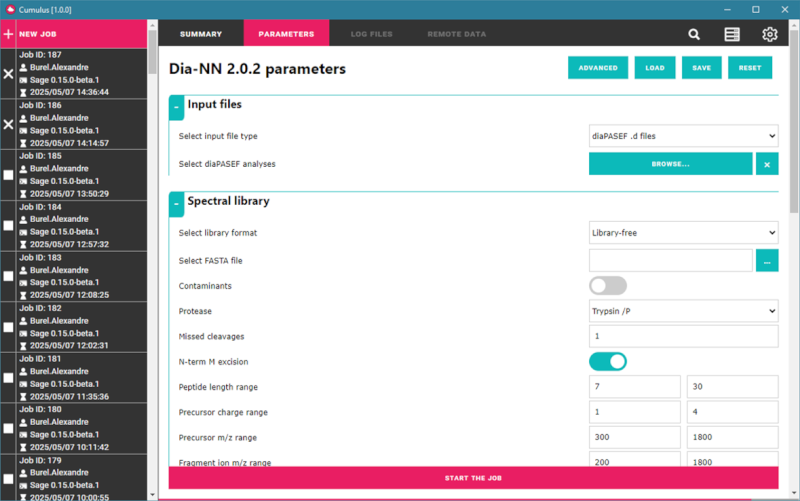

# cumulus-client

This repository is for the client graphical interface for Cumulus.

Cumulus-client is a full-JS client for Cumulus. It has been developped using [ElectronJS](https://www.electronjs.org/), CSS and HTML.

The client allows you to create new jobs, visualize previous jobs, have a look at parameters, logs and download output files. You can also search for jobs, view the files already on the server, and change settings.

The client has been developped around the idea that end users should not have to learn how to use a Cloud, we tried to create a user-friendly interface so they don't even have to read documentation before using it.

Users can run different applications directly on the Cloud from the interface, as they would do on their own computer. The applications are stored on the server, the list is detailed on the corresponding page.

## What is Cumulus

Cumulus is a three-part tool whose purpose is to run software on a Cloud, without requiring the users to have any computational knowledge. Cumulus is made of three elements: 
* [A client](https://github.com/LSMBO/cumulus-client) with a graphical user interface developped in Javascript using ElectronJS.
* [A server application](https://github.com/LSMBO/cumulus_server), running on the Cloud. The server will dispatch the jobs, monitor them, and store everything in a database. The server is developped in Python and provides a Flast REST API for the client and the agent.
* [A separate agent](https://github.com/LSMBO/cumulus_rsync) who manages the transfer of the files from client to server. The agent is developped in Python and provides a Flask REST API for the client.

Cumulus has been developped to work around the [SCIGNE Cloud at IPHC](https://scigne.fr/), it may require some modifications to work on other Clouds, depending on how the virtual machines are organized. The virtual machines currently in use for Cumulus are set up like this:
* A controller with 4 VCPU, 8GB RAM, 40GB drive, this is where cumulus-server is running. This VM is the only one with a public IP address.
* Four virtual machines with 16 to 64VCPU and 64 to 256GB RAM, this is where the jobs will be running. These VM can be accessed by the controller using SSH.
* A 15TB storage unit, mounted as a NFS shared drive on every VM so the content is shared with the same path. This is where the data, the jobs and apps will be stored.

The virtual machines on the Cloud are all running with Ubuntu 24.04, Cumulus has only been tested there so it's possible that some scripts may not work on a different Linux distribution.

The Agent's purpose is to provide a single queue to ease the transfer of large files. Cumulus has been developped to run applications dealing with mass spectrometry data, which are often between 1 and 10GB. Cumulus has been developped for a use in a work environment with a dedicated network, where data are stored on a server, and users are running apps on their own sessions. In that context, it is more effective to transfer data from the server directly, rather than from each user's session. The queue is stored in a local database, so it does not disappear if the agent has to be restarted.

The agent has been tested on a Windows server, and uses [cwRsync](https://www.itefix.net/cwrsync), but it should work on a Linux server using a local RSync command. Scripts to create a Windows service are provided.

